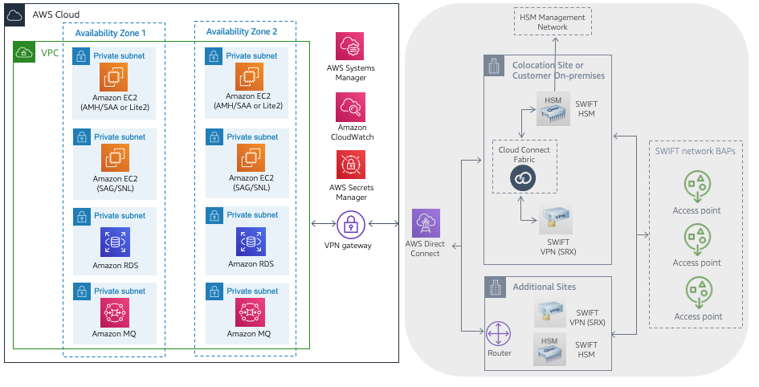
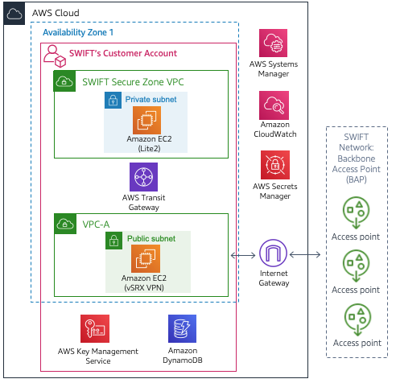

//Include any predeployment steps here, such as signing up for a Marketplace AMI or making any changes to a partner account. If there are no predeployment steps, leave this file empty.

== Predeployment steps

This Quick Start assumes familiarity with the SWIFT Connectivity components and software options. SWIFT Connectivity on AWS enables other backend payments applications to interface with the SWIFT network.

[#architecture2]
.Sample architecture for {partner-product-short-name} on AWS connecting to SWIFT network via colocation site

This figure shows components that are out of scope for this deployment:

* This architecture aligns with SWIFT security control 1.1, where it's mandated that connectivity components be located in a secure zone.
* VPC endpoints provide connectivity to the following AWS security services:
 ** AWS Systems Manager is used to satisfy security controls 2.1, 2.6, 4.2, and 6.4.
 ** Amazon CloudWatch is used to satisfy security control 6.4.
 ** AWS Secrets Manager is used to satisfy security controls 2.1, 4.1, and 5.4.
* AMH integrates into the SWIFT product portfolio by providing an abstraction layer for messaging and routing.
* SAG is a communication interface that connects to SWIFT via a single instance of SNL.
* AWS Direct Connect is used to connect to the SWIFT network, which, with a colocation site (for example, Interxion or Equinix), hosts the SWIFT HSM for message signing and (optionally) VPN devices for securing connectivity to Backbone Access Points (BAP).
* HSM device hosted in a colocation data center such as Interxion or Equinix.
* A BAP is an entry point to the SWIFT network.

Beginning in Q2 of 2022 the new https://www.swift.com/our-solutions/interfaces-and-integration/alliance-connect-virtual[Alliance Connect Virtual^] option from SWIFT is available for customers to deploy the VPN on AWS.  This architecture is compliant with SWIFT CSP security controls framework.

[#architecture3]
.Sample architecture for {partner-product-short-name} on AWS connecting to SWIFT network with virtual VPN

UPDATED May 2022: This figure shows components that are required for the virtual VPN:

* In May 2022, Swift launched a new https://www.swift.com/our-solutions/interfaces-and-integration/alliance-connect-virtual[Alliance Connect Virtual^] solution, which is available with a CloudFormation template provided by SWIFT.
* The first version of Alliance Connect Virtual supports internet connectivity to the SWIFT network.
* An AWS Marketplace subscription is required for the software (only to accept Terms & Conditions).
* AWS Transit Gateway is a network hub to interconnect the VPCs.
* AWS Key Management Service is used by the virtual VPN software to safeguard the private keys.
* Amazon DynamoDB is used to store transient metadata by the virtual VPN software library.

=== Planning the deployment
This deployment is intended for IT security professionals and assumes familiarity with basic security concepts in the areas of networking, operating systems, data encryption, operational controls, and cloud computing. This guide includes an option to host the VPN and HSM components either on-premises or in a colocation site.

This Quick Start requires a moderate to high-level understanding of how to manage SWIFT security control requirements and compliance processes within a hosting environment. This deployment also requires a moderate understanding of the following: https://docs.aws.amazon.com/servicequotas/latest/userguide/intro.html[Service Quotas^], https://docs.aws.amazon.com/cdk/latest/guide/home.html[AWS Cloud Development Kit (AWS CDK)^], and https://docs.aws.amazon.com/AWSCloudFormation/latest/UserGuide/Welcome.html[AWS CloudFormation^].

The deployment process takes about {deployment_time} to complete, and the template launches in the {default_deployment_region} Region by default.

=== Launch the Quick Start
To deploy this Quick Start, use AWS CDK and Python. For more information, see https://docs.aws.amazon.com/cdk/latest/guide/work-with-cdk-python.html[Working with the AWS CDK in Python].

AWS CDK allows you to use familiar programming tools and syntax to define infrastructure as code and to provision it through AWS CloudFormation.

. Ensure that you have the AWS CDK toolkit installed:

  npm install -g aws-cdk

. Verify the installation and check the current version:

  cdk --version

. Deploy the resources defined in the SWIFT Connectivity stack:

  git clone https://github.com/aws-quickstart/quickstart-swift-digital-connectivity.git
  cd quickstart-swift-digital-connectivity

  . Install the application's dependencies:

  pip install -r requirements.txt

. Edit the `cdk.json` file to reflect your specific environment.

. Deploy the AWS CDK Toolkit stack (for more information, see https://docs.aws.amazon.com/cdk/latest/guide/bootstrapping.html[Bootstrapping^]):

  cdk bootstrap

. Deploy the CDK stack:

  cdk deploy
