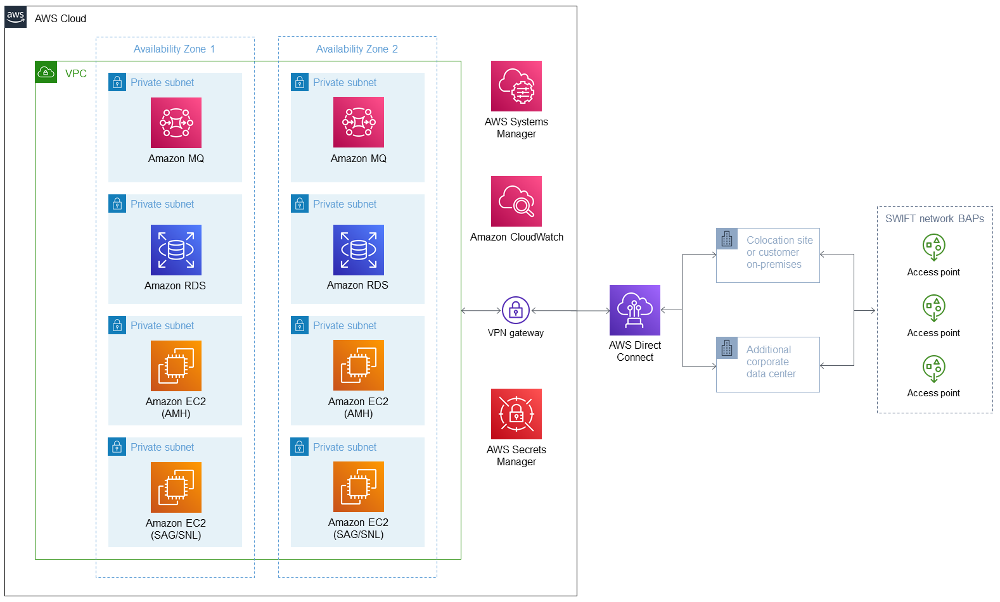

Deploying this Quick Start for a new virtual private cloud (VPC) builds the following {partner-product-short-name} environment in the AWS Cloud.

// Replace this example diagram with your own. Send us your source PowerPoint file. Be sure to follow our guidelines here : http://(we should include these points on our contributors giude)
:xrefstyle: short
[#architecture1]
.Quick Start architecture for {partner-product-short-name} on AWS

As shown in <<architecture1>>, this Quick Start sets up the following:

* An architecture that spans two Availability Zones.
* A VPC configured with private subnets, according to AWS best practices and in compliance with SWIFT CSP guidance, to provide you with your own virtual network on AWS.
* In the private subnets:
** Amazon MQ instances to handle communication for AMH. 
** An Amazon Relational Database Service (Amazon RDS) Oracle instance running in active or standby mode to store configuration and message data for AMH.
** Amazon Elastic Compute Cloud (Amazon EC2) instances running SWIFT components (AMH and SAG/SNL).
* AWS Systems Manager, which removes the need for a jump server.
* Amazon CloudWatch, which provides the mechanism to store, access, and monitor SWIFT activities.
* A VPN gateway with load balancing, which connects the VPC to AWS Direct Connect.*
* AWS Secrets Manager, which encrypts, stores, and retrieves passwords.
* AWS Direct Connect, which establishes private connectivity between AWS and data centers or colocation environments.*

*The cloud development kit (CDK) that deploys this Quick Start does not cover the components marked by asterisks because this requires a design decision on how to connect to the SWIFT network.
