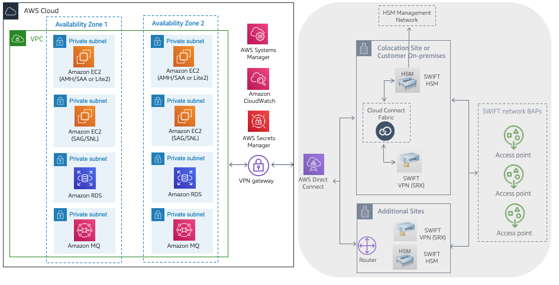

// Replace the content in <>
// For example: “familiarity with basic concepts in networking, database operations, and data encryption” or “familiarity with <software>.”
// Include links if helpful. 
// You don't need to list AWS services or point to general info about AWS; the boilerplate already covers this.

This Quick Start assumes familiarity with the SWIFT Connectivity components and software options. SWIFT Connectivity on AWS enables other backend payments applications to interface with the SWIFT network.

[#architecture2]
.Sample architecture for {partner-product-short-name} on AWS connecting to SWIFT network via colocation site

This figure shows components that are out of scope for this deployment:

* This architecture aligns with SWIFT security control 1.1, where it's mandated that connectivity components be located in a secure zone.  
* VPC endpoints provide connectivity to the following AWS security services:
 ** AWS Systems Manager is used to satisfy security controls 2.1, 2.6, 4.2, and 6.4.
 ** Amazon CloudWatch is used to satisfy security control 6.4.
 ** AWS Secrets Manager is used to satisfy security controls 2.1, 4.1, and 5.4.
* AMH integrates into the SWIFT product portfolio by providing an abstraction layer for messaging and routing.  
* SAG is a communication interface that connects to SWIFT via a single instance of SNL. 
* AWS Direct Connect is used to connect to the SWIFT network, which, with a colocation site (for example, Interxion or Equinix), hosts the SWIFT HSM for message signing and (optionally) VPN devices for securing connectivity to Backbone Access Points (BAP).
* HSM device hosted in a colocation data center such as Interxion or Equinix.
* A BAP is an entry point to the SWIFT network.

Beginning in Q2 of 2022 the new https://www.swift.com/our-solutions/interfaces-and-integration/alliance-connect-virtual[Alliance Connect Virtual^] option from SWIFT is available for customers to deploy the VPN on AWS.  This architecture is compliant with SWIFT CSP security controls framework.

[#architecture3]
.Sample architecture for {partner-product-short-name} on AWS connecting to SWIFT network with virtual VPN
image::../images/figure3public.png[Architecture,width=55%,height=55%]

UPDATED May 2022: This figure shows components that are required for the virtual VPN:

* In June 2022 Swift launched a new https://www.swift.com/our-solutions/interfaces-and-integration/alliance-connect-virtual[Alliance Connect Virtual^] solution which is available with a CloudFormation template provided by SWIFT.
* The first version of Alliance Connect Virtual supports internet connectivity to the SWIFT network.
* An AWS Marketplace subscription is required for the software (only to accept Terms & Conditions).
* AWS Transit Gateway is a network hub to interconnect the VPCs.
* AWS Key Management Service is used by the virtual VPN software to safeguard the private keys.
* Amazon DynamoDB is used to store transient metadata by the virtual VPN software library.