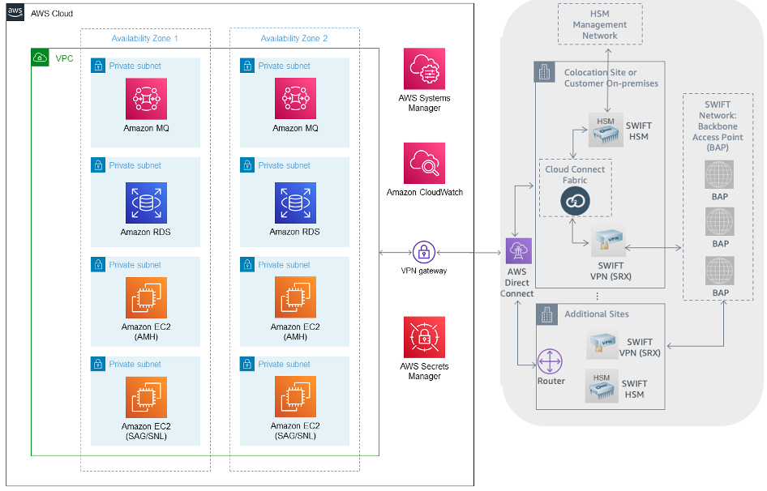

// Replace the content in <>
// For example: “familiarity with basic concepts in networking, database operations, and data encryption” or “familiarity with <software>.”
// Include links if helpful. 
// You don't need to list AWS services or point to general info about AWS; the boilerplate already covers this.

This Quick Start assumes familiarity with the SWIFT Connectivity components and software options. SWIFT Connectivity on AWS enables other backend payments applications to interface with the SWIFT network.

[#architecture2]
.Sample architecture for {partner-product-short-name} on AWS connecting to SWIFT network via colocation site

<<figure2>> shows components that are out of scope for this deployment:

* This architecture aligns with SWIFT security control 1.1, where it's mandated that connectivity components be located in a secure zone.  
* VPC endpoints provide connectivity to the following AWS security services:
 ** AWS Systems Manager is used to satisfy security controls 2.1, 2.6, 4.2, and 6.4.
 ** Amazon CloudWatch is used to satisfy security control 6.4.
 ** AWS Secrets Manager is used to satisfy security controls 2.1, 4.1, and 5.4.
* AMH integrates into the SWIFT product portfolio by providing an abstraction layer for messaging and routing.  
* SAG is a communication interface that connects to SWIFT via a single instance of SNL. 
* AWS Direct Connect is used to connect to the SWIFT network, which, with a colocation site (that is, Interxion), hosts the SWIFT HSM for message signing and VPN devices for securing connectivity to Backbone Access Points (BAP).
* HSM device in the Interxion data center is remotely managed by Exceet.
* A BAP is an entry point to the SWIFT network.
